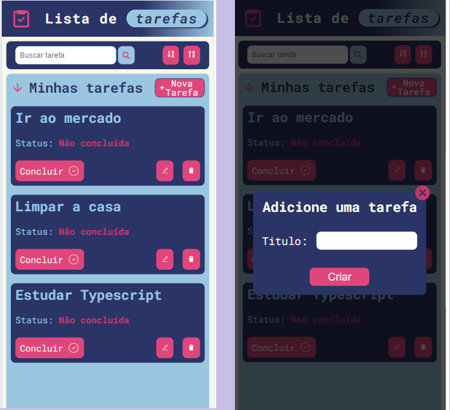

# Projeto lista de tarefas

  

## Indice

1. <a href='#funcionalidades-do-projeto'>Funcionalidades</a>
2. <a href='#layout'>Layout</a>
3. <a href='#demonstração'>Demonstração</a>
4. <a href='#como-rodar-o-projeto'>Como rodar o projetos</a>
5. <a href='#tecnologias-utilizadas'>Tecnologias utilizadas</a>

## Funcionalidades do projeto

- [x] Criar, editar e deletar uma tarefa
- [x] Buscar tarefas pelo título
- [x] Ordenar tarefas entre ordem crescente e decrescente

## Layout



## Demonstração

Link pro app: https://lista-de-tarefas-pi-seven.vercel.app/

## Como rodar o projeto:

1. Certifique-se de ter o Node.js instalado (versão superior a 16.0.0).
2. Clone este repositório.
3. Na raiz do projeto execute o seguinte comando para instalar as dependências:

   ```
   npm install
   ```

4. Para iniciar o servidor de desenvolvimento, execute:

   ```
   npm run dev
   ```

5. Acesse pelo navegador : http://localhost:5173/

## Tecnologias utilizadas

- [React](https://react.dev/)
- [Styled-components](https://styled-components.com/)
- [React-icons](https://react-icons.github.io/react-icons/)
- [Zustand](https://zustand-demo.pmnd.rs/)
